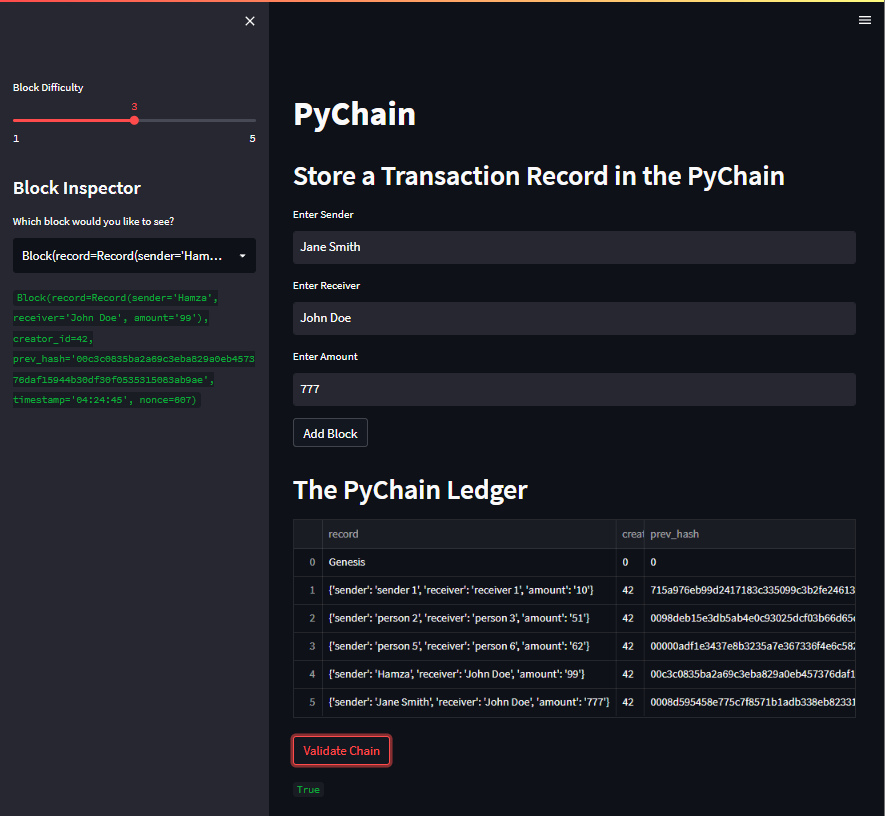
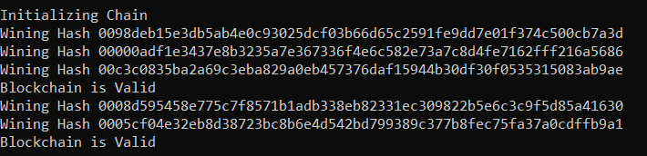

## Pychain Ledger

In this case study, a pseudo-blockchain was created and tested to display how data is stored and 'chained' together while being both immutable and verifieable. 
-
The below image shows the interface for adding blocks, the table that contains all current blocks and chain validity. On the left side, the block explorer can also be seen

In this image, the streamlit console shows the behind the scenes proof of work hashing and validations.

## Dependencies
Streamlit, dataclasses, typing, datetime, pandas, hashlib